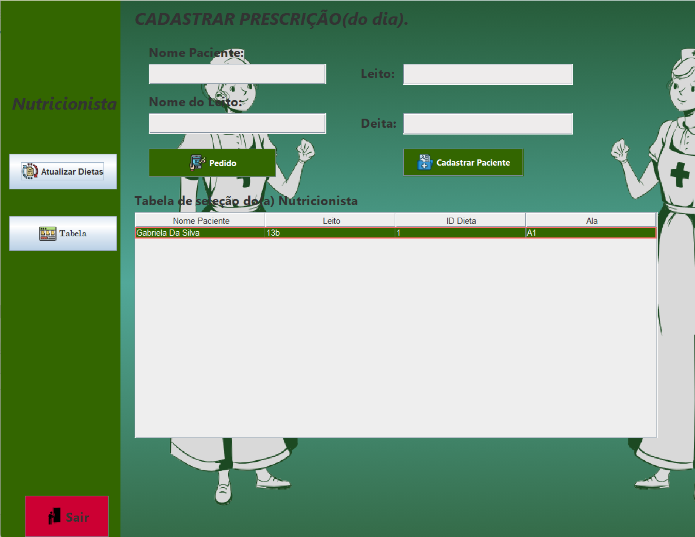
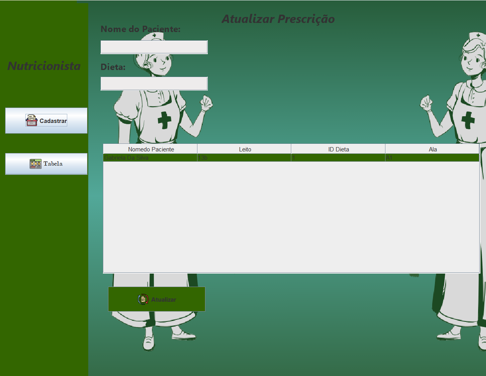
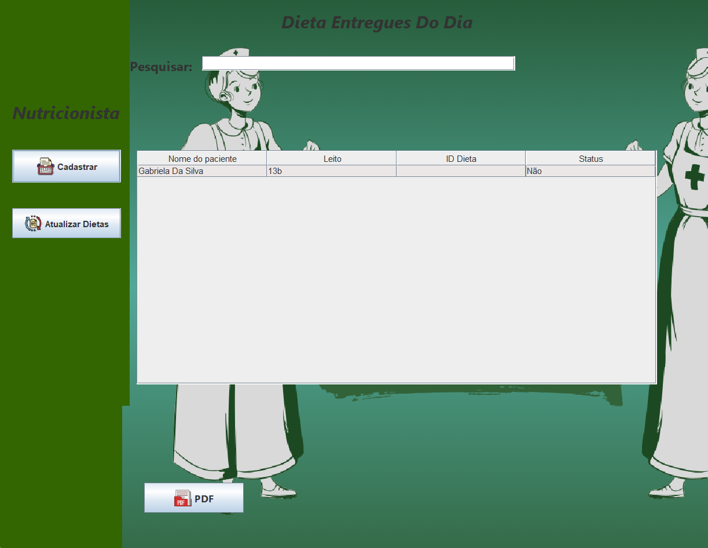
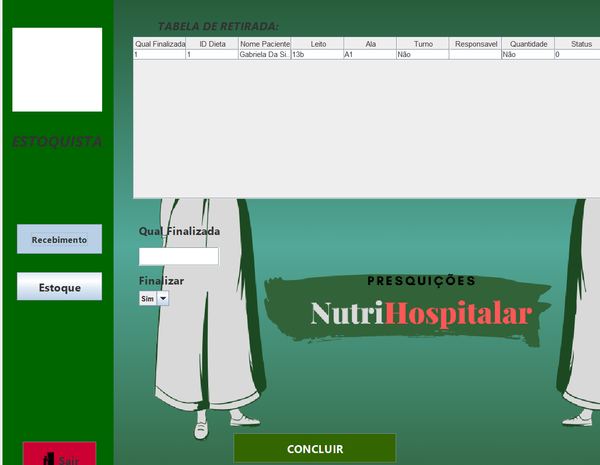
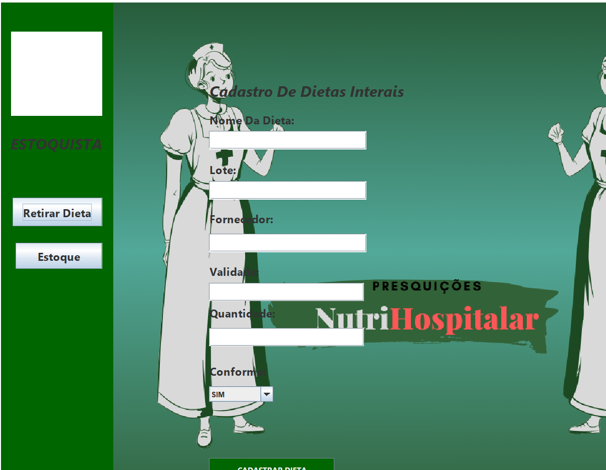
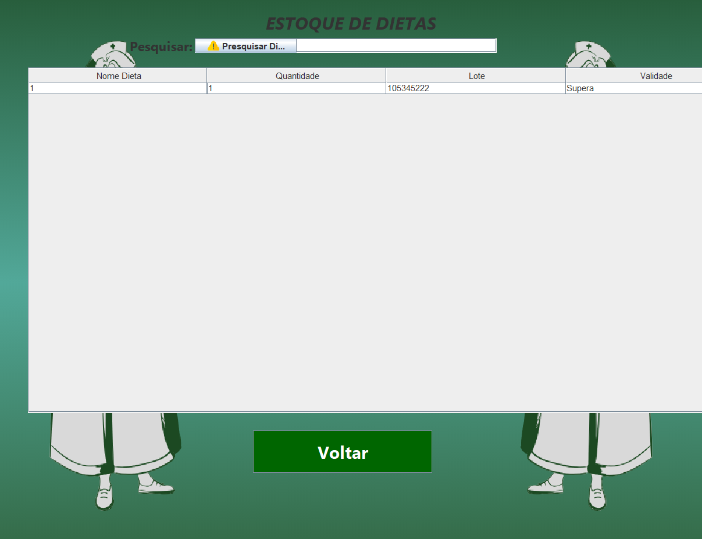

# NutriHospitalar

Este aplicativo foi desenvolvido para facilitar a entrega de dietas enterais. A nutricionista faz uma prescrição e envia para o estoquista. No estoque, o funcionário responsável recebe 
essas informações e monta uma bandeja com todas as informações passadas para ele. Assim, outra pessoa pode exportar esses itens para o paciente. Todas as informações passadas vão para o banco de dados 
e aparecem em uma tabela onde a nutricionista terá o controle dos pacientes que já receberam suas dietas no dia.

## Como Usar
Login Nutricionista/Estoquista: O login dos funcionários é diferente. Eles receberão um e-mail e uma senha fornecidos pelos responsáveis pelo projeto.

# Tela Nutricionista: 
## No menu estarão as opções :

## Cadastrar Prescrição: 
Nessa opção, a nutricionista poderá registrar as informações do paciente e a dieta 
que ele estará utilizando. A prescrição inclui todos os detalhes necessários para garantir que a dieta seja fornecida corretamente, conforme as necessidades clínicas de cada paciente.

## Atualizar Prescrição:
Caso o paciente apresente sinais de melhora ou haja qualquer alteração no quadro clínico (como mudança de leito ou ala), a nutricionista pode atualizar a prescrição para garantir que as dietas sejam ajustadas conforme a evolução do paciente.

## Tela Info:
Nesta tela, será gerado um arquivo PDF com as informações detalhadas do paciente e sua dieta prescrita. Esse PDF é enviado ao estoquista para que ele possa montar a bandeja de forma precisa, seguindo as orientações da nutricionista.

# Tela Depósito 
## No menu estarão as seguintes opções:

## Finalizar:
Após receber a prescrição em formato PDF, o estoquista monta a bandeja com todos os itens especificados. Ao concluir a montagem, 
a opção "Finalizar" permite registrar a entrega da dieta e encaminhar para o paciente, garantindo que todas as etapas foram cumpridas corretamente.

## Cadastrar: 
Essa opção permite que o estoquista registre novas dietas recebidas, incluindo suas respectivas informações. O processo de cadastro é simples e rápido, garantindo que todos os itens sejam facilmente acessados no momento de sua preparação.

## Pesquisar:
Nessa tela, o estoquista poderá conferir as dietas, a quantidade e, o mais importante, a validade delas. Ela garante que não haverá desperdício de dietas enterais, além de fornecer uma resposta sobre as informações da dieta.

